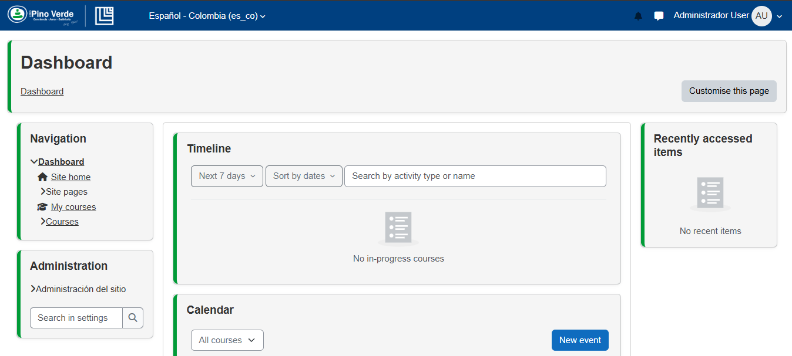
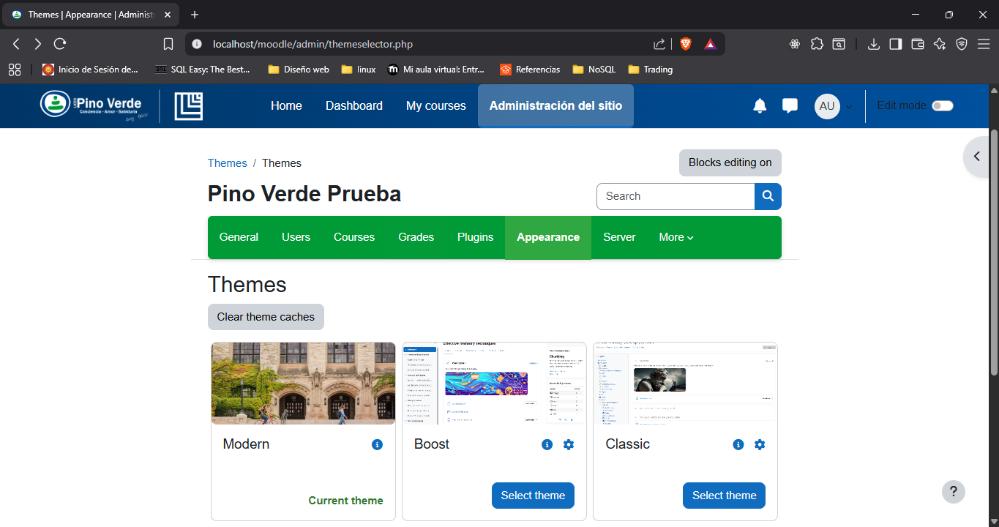

# Mis temas personalizados para Moodle

Tenia dudas  con la creación de temas para Moodle y terminé haciendo **dos**, cada uno con un enfoque diferente.  
Uno lo construí partiendo de un tema ya existente y adaptándolo, y el otro lo hice casi desde cero.  
La idea es mostrar las dos maneras que existian para hacer el theme no sabia cual de las 2 opciones era la correcta

---

## 🌿 Tema Pino Verde

El **Pino Verde** lo hice clonando el tema **Classic**.  
Me gustó la idea de no tener que empezar de cero, así que aproveché toda su estructura y solo me enfoqué en cambiar la parte visual.  
Para eso creé mi archivo `pinoverde.scss`, donde metí los colores, tipografías y detalles que quería.

Lo bueno de hacerlo así es que el tema base ya está probado, funciona bien y solo tienes que dedicarte a personalizar la apariencia.  
En mi caso, jugué bastante con tonos verdes y azules para que quedara un estilo limpio y fresco.

**En resumen:**
- Basado en **Classic**.
- Personalización en `pinoverde.scss`.
- Cambios de colores, tipografía y detalles visuales.
- Mantiene la funcionalidad intacta del Classic.

---

## ✨ Tema Modern

El **Modern** fue más un reto personal.  
Lo empecé prácticamente desde cero, siguiendo la documentación oficial de Moodle:  
[Desarrollo: Temas 2.0 - Creando tu primer tema](https://docs.moodle.org/all/es/Desarrollo:Temas_2.0_creando_tu_primer_tema#Primeros_pasos)  

Quise hacerlo así para tener más libertad de diseño y aprender realmente cómo se construye un tema desde la base.  

---

## 📷 Capturas

---
